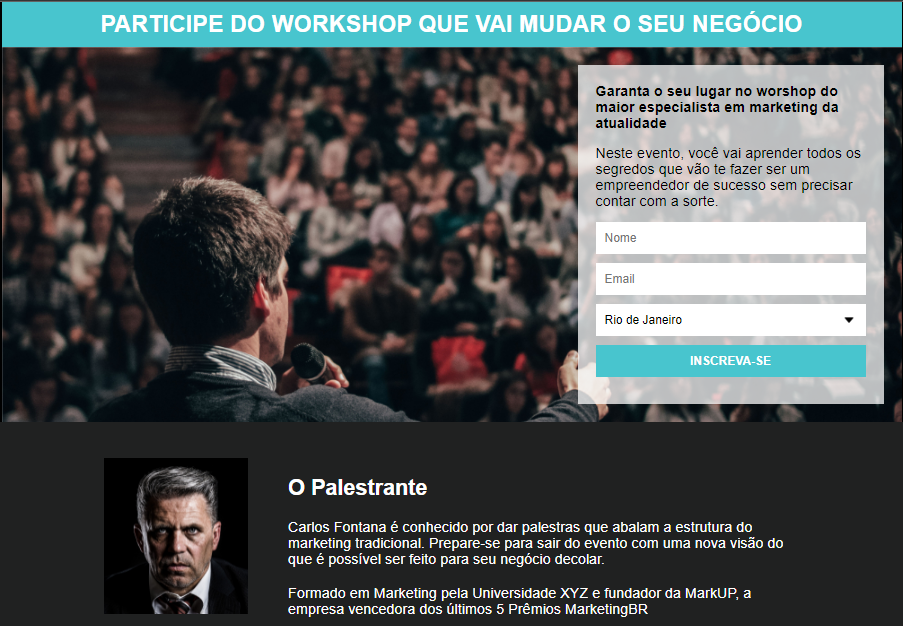

# PaginaDeCaptura

Meu primeiro projeto desenvolvido juntamente com o curso <b>PROGRAMADOR BR</b>.

Tecnologias usadas:
<ul>
  <li> HTML5</li>
  <li> CSS3 </li>
</ul>  

Desafios superados:
<ul>
  <li> Criação dos containers com tamanhos especificos.</li>
  <li> Criação da caixa de cadastro "flutuante". </li>
  <li> Integração da caixa de cadastro com email chimp.</li>
</ul>  
